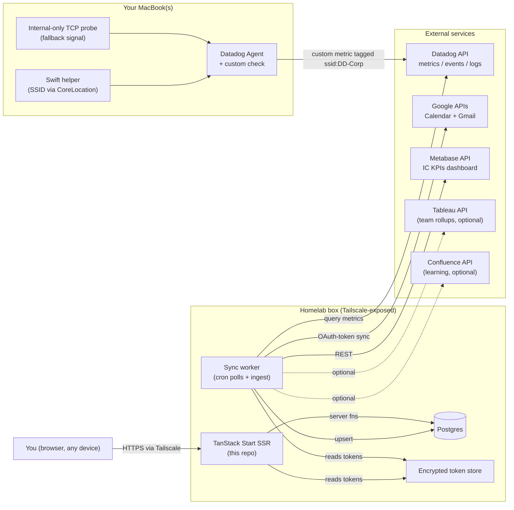
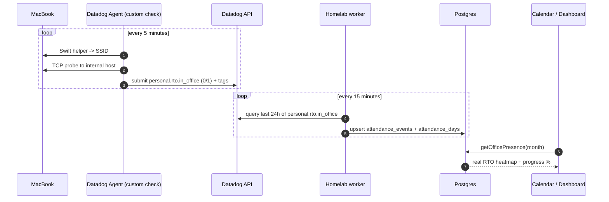

# Work Dashboard — Site Map

A visual map of what needs to exist to turn the prototype into a functional, single-user, homelab-hosted dashboard. No code, no timeline — just the picture.

## 1. System map

## 2. Components to build

### On the MacBook(s)
- **Swift helper binary** — small CLI that prints current Wi-Fi SSID via CoreLocation (replacement for the removed `airport` CLI on macOS 14.4+).
- **Datadog Agent custom check** — `wifi_attendance.py` + its `conf.yaml`. Runs every 5 minutes. Submits `personal.rto.in_office` (0/1) tagged with `ssid:` and `host:`. Uses the Swift helper for SSID and the TCP probe as a fallback signal.
- **Internal-only TCP probe** — connection test to a host only reachable on corp Wi-Fi, so attendance still logs even if SSID API is locked down.

### On the homelab box
- **Web app** — this repo (`npm run start`), unchanged in shape, but pages read from Postgres instead of `src/lib/*.ts` mocks.
- **Sync worker** — separate Node process. Runs cron-style jobs that pull from external services and upsert into Postgres.
- **Postgres** — single database, the canonical source of truth for everything the UI renders.
- **Encrypted token store** — file-backed, age-encrypted secrets (Google OAuth refresh tokens, Datadog API/App keys, Metabase session). Read by web + worker, never returned to the browser.
- **Tailscale (or equivalent)** — the network boundary. No app-level auth in v1 — being on your tailnet is the auth.

### External services (already exist, you just consume them)
- **Datadog API** — source for RTO attendance (queries the custom metric your Agent submits).
- **Google Calendar API** — source for meetings + non-RTO calendar events.
- **Gmail API** — source for the emails page.
- **Metabase API** — source for the live scorecard numbers (the IC KPIs dashboard already linked in `src/lib/scorecard-data.ts`).
- **Tableau / Confluence APIs** — optional, only if you want team-level rollups or auto-synced learning items.

## 3. Page → data source map

| Page | Currently | Functional source |
| --- | --- | --- |
| `/` Dashboard | Aggregates mock data from every page | Aggregates real data from every page — nothing new to build here |
| `/tasks` | Static array | Native CRUD in `tasks` table (optionally pull from Linear/Todoist) |
| `/calendar` | `mockDays` + static RTO config | `attendance_days` from Datadog metric + Google Calendar events overlay |
| `/meetings` | Static array | Google Calendar API (events with attendees or conference data), cached in `meetings` table |
| `/emails` | Static array | Gmail API (`is:unread newer_than:7d`), cached in `emails` table |
| `/learning` | Static array | Native CRUD in `learning_items` table |
| `/office-life` | Static | Derived from `attendance_days` + a manual/scraped `meals` table |
| `/scorecard` | Hardcoded structure (`src/lib/scorecard-data.ts`) | Same structure, with each metric's current value pulled from the Metabase IC KPIs dashboard |
| `/settings` | UI only | OAuth connect + API-key entry; writes to the encrypted token store |
| Notifications popover | Static array | `notifications` table written by the worker (new meeting invite, stale unread email, upcoming RTO day, training due, etc.) |

## 4. The RTO attendance flow (your hero question)

Two ingest paths exist:

- **A. Via Datadog (recommended).** Agent submits a metric, worker queries it back via Datadog's API. Works with infra you already have, no public endpoint needed.
- **B. Direct webhook to homelab.** Replace the Agent submission with a launchd job that POSTs straight to the dashboard over Tailscale. Pick this only if you don't want personal RTO data flowing through your Datadog tenant.

## 5. New things in this repo (just the shape)

Not building yet — this is just the file/folder skeleton the site map implies:

- `src/db/` — Drizzle schema + migrations (`tasks`, `meetings`, `emails`, `learning_items`, `attendance_events`, `attendance_days`, `meals`, `notifications`, `oauth_tokens`).
- `src/worker/` — separate Node entry; cron jobs for Datadog poll, Google sync, Metabase sync, notification rules.
- `src/lib/integrations/` — thin clients: `datadog.ts`, `google.ts`, `metabase.ts`.
- `src/lib/secrets.ts` — read/write the age-encrypted token store.
- `agent/` (outside the app) — the Swift helper source + the Datadog Agent check files you copy onto each MacBook.
- `docker-compose.yml` at the repo root — `web` + `worker` + `db` services.

## 6. Open questions (decide before any build)

- Is a custom Datadog Agent check on your work MacBook OK with SecOps, or do you want path B (homelab webhook, RTO data stays off the Datadog tenant)?
- Can you mint personal **Datadog API + Application keys** with `metrics_read`? If not, path B becomes the default.
- Which MacBook(s) should report attendance — laptop only, or laptop + any office desktop you use? Multi-host is free; the metric is tagged by `host:`.
- For tasks: native CRUD only, or also sync from an existing tool (Linear / Todoist / Apple Reminders)?
- For office-life meals: manual entry, or is there an internal cafeteria page worth scraping?
